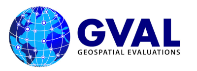

GVAL (pronounced "g-val") is a high-level Python framework to evaluate the geospatial skill of candidate maps to benchmarks producing agreement maps and metrics.

NOTE: THIS PACKAGE IS UNDER ACTIVE DEVELOPMENT AND NOT CURRENTLY FUNCTIONING. BREAKING CHANGES ARE OFTEN INTRODUCED.
