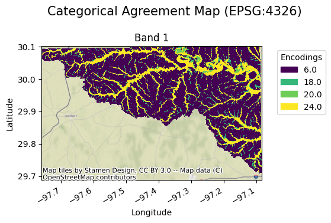
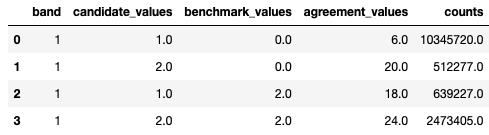

# Using GVAL

### Categorical Example
An example of running the entire process for two-class categorical rasters with one function using minimal arguments is demonstrated below:

```python
import gval
import rioxarray as rxr

candidate = rxr.open_rasterio('candidate_map_two_class_categorical.tif', mask_and_scale=True)
benchmark = rxr.open_rasterio('benchmark_map_two_class_categorical.tif', mask_and_scale=True)

(agreement_map,
 crosstab_table,
 metric_table) = candidate.gval.categorical_compare(benchmark,
                                                   positive_categories=[2],
                                                   negative_categories=[0, 1])
```

#### Categorical Outputs

`agreement_map`



`crosstab_table`



`metric_table`


### Continuous Example

The same can be done for rasters with continuous valued statistical data types as shown below (in this case only a
subset of the default statistics will be run):

```python
import gval
import rioxarray as rxr

candidate = rxr.open_rasterio('livneh_2011_precip.tif', mask_and_scale=True) # VIC
benchmark = rxr.open_rasterio('prism_2011_precip.tif', mask_and_scale=True) # PRISM

agreement, metric_table = candidate.gval.continuous_compare(
    benchmark,
    metrics=[
        "coefficient_of_determination",
        "mean_percentage_error",
        "mean_absolute_percentage_error",
        "mean_normalized_mean_absolute_error"
    ]
)
```

#### Continuous Outputs

`agreement_map`


`metric_table`


### Catalog Example

Entire catalogs can be compared in GVAL, which are represented by dataframes of maps.  The following is a candidate
and benchmark catalog for continuous datasets:

`candidate_catalog`


`benchmark_catalog`


With the following code a comparison of each pair of maps can be run with the following code.  Since the parameter
`agreement_map_field` is provided the column `agreement_maps` found in the candidate catalog will be used to
export the agreement map to that location. (Note the first pair of
candidate and benchmark maps are single band rasters while the second pair are multiband rasters):

```python
import pandas as pd

from gval.catalogs.catalogs import catalog_compare

candidate_continuous_catalog = pd.read_csv('candidate_catalog_0.csv')
benchmark_continuous_catalog = pd.read_csv('benchmark_catalog_0.csv')

arguments = {
    "candidate_catalog": candidate_continuous_catalog,
    "benchmark_catalog": benchmark_continuous_catalog,
    "on": "compare_id",
    "agreement_map_field": "agreement_maps",
    "map_ids": "map_id",
    "how": "inner",
    "compare_type": "continuous",
    "compare_kwargs": {
        "metrics": (
            "coefficient_of_determination",
            "mean_absolute_error",
            "mean_absolute_percentage_error",
        ),
        "encode_nodata": True,
        "nodata": -9999,
    },
    "open_kwargs": {
        "mask_and_scale": True,
        "masked": True
    }
}

agreement_continuous_catalog = catalog_compare(**arguments)
```

#### Catalog Outputs

`agreement_map`


`catalog_metrics`


(Note that both catalog level attributes in the candidate and benchmark catalogs are present in the catalog metrics
table.)

For more detailed examples of how to use this software, check out these
[notebook tutorials](https://github.com/NOAA-OWP/gval/blob/main/notebooks).
