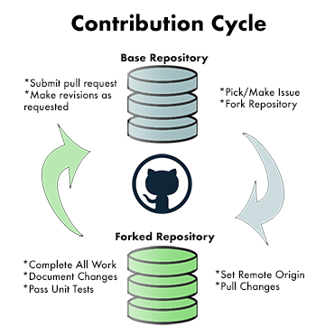

# Contributing

> All contributions to this project will be released to the public domain.
> By submitting a pull request or filing a bug, issue, or
> feature request, you are agreeing to comply with this waiver of copyright interest.
> Details can be found in our [TERMS](TERMS.MD) and [LICENSE](LICENSE.MD).

There are two primary ways to help:
 - Using the issue tracker, and
 - Changing the code-base.

## Using the issue tracker

Use the issue tracker to suggest feature requests, report bugs, and ask questions.
This is also a great way to connect with the developers of the project as well
as others who are interested in this solution.

Use the issue tracker to find ways to contribute. Find a bug or a feature, mention in
the issue that you will take on that effort, then follow the _Changing the code-base_
guidance below.

## Changing the code-base

Generally speaking, you should fork this repository, make changes in your
own fork, and then submit a pull request. All new code should have associated
unit tests that validate implemented features and the presence or lack of defects.
Additionally, the code should follow any stylistic and architectural guidelines
prescribed by the project. In the absence of such guidelines, mimic the styles
and patterns in the existing code-base.

### Guidelines

If you would like to contribute, please follow the following steps:

1. Fork the project.
2. Clone your fork: `git clone <your_username>/gval`
3. Create a feature branch: `git checkout -b <your_feature>`
4. Code Standards: Make sure unit tests pass `pytest`, there is code coverage `pytest-cov`, and error/style linting `flake8`
5. If linting issues either make manual changes and/or use `black .` to autoformat.  Afterwards repeat step 4. 
6. Commit your changes: `git commit -m 'feature message'`
7. Push to the branch: `git push origin <your_username> <your_feature>`
8. Open a pull request.

## Tooling Dependencies
- Code Checking with [Flake8](https://github.com/PyCQA/flake8)
    - Combines PyFlakes, pycodestyle, and others for linting and style checking.
    - For autoformatting: [flake8-black](https://pypi.org/project/flake8-black/)
- Testing with [PyTest](https://docs.pytest.org/en/7.1.x/contents.html)
    - For timed tests: [pytest-benchmark](https://pypi.org/project/pytest-benchmark/)
    - For code coverage: [pytest-cov](https://pypi.org/project/pytest-cov/)
- Profiling
    - [yappi](https://github.com/sumerc/yappi/)
    - For memory profiling: [memray](https://pypi.org/project/memray/)
    - Dask memory profiling: [dask-memusage](https://github.com/itamarst/dask-memusage)
- Dependencies and Packaging
    - [pip](https://packaging.python.org/en/latest/key_projects/#pip)
    - Docker
- Distribution
    - [PyPI](https://pypi.org/)
    - DockerHub
    - GitHub (source, packaging, and images)
- Docs
    - [Sphinx](https://www.sphinx-doc.org/)
    - [pandoc](https://pypi.org/project/pandoc/)
    - [ReadTheDocs](https://readthedocs.org/)
    - [Jupyter](https://pypi.org/project/jupyter/)

## Development Installation

(In this case, the image name, "gval-image", and container name, "gval-python" can be changed
to whatever name is more suitable.  Script, "test.py", does not exist and is an arbitrary placeholder for 
script of choice.)

First setup docker instance and in the root directory of the project:

`sudo docker build -t gval-image --target development . `

The default user named 'user' with UID 1001 is created.  To use the same user and permissions you
currently have on your machine override with build arguments:

`sudo docker build -t gval-image --build-arg UID=1002 --build-arg USER=$(id -u):$(id -g) --target development . `

Standard run examples from the command line (standard, or overriding user with root):

- `sudo docker run -d -v $(pwd):/home/user/ --name gval-python gval-image`
- `sudo docker run -d -v $(pwd):/home/user/ --user root --name gval-python gval-image`

You can also set up your IDE to run this docker image directly:
- [PyCharm](https://www.jetbrains.com/help/pycharm/using-docker-as-a-remote-interpreter.html#config-docker)
- [Visual Studio Code](https://code.visualstudio.com/docs/containers/quickstart-python)

If the container already exists you can start as follows:

`sudo docker start gval-python`

Then run a python file:
`sudo docker exec gval-python python test.py`

## Packaging

To build the gval package and install locally:

- In the root directory install the gVal package:

  `python -m build && pip install dist/*.whl --force-reinstall`
- Or on Windows replacing version number with current version number: 

  `py -m build` then get the name of the wheel in the dist directory, e.g.:

  `pip install dist/gval-0.0.1-py3-none-any.whl --force-reinstall`

The packaging process using docker container would look as follows (on linux):

`sudo docker exec -v $(pwd):/home/user/ --user root python -m build && pip install dist/*.whl --force-reinstall`

